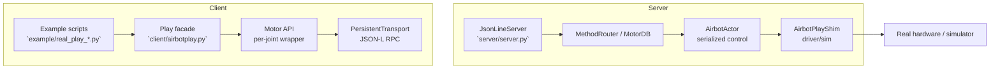

# Hardware-Sim Examples README

This project provides a motion-control RPC service (`server/server.py`) built on the `Play` facade, plus several real-device example scripts (under `example/`).

Think of `server/server.py` as the entry point to “create an Airbot instance for the simulator”:
- A real robot already exists, so you just send commands over the bus.
- A simulator has no robot yet, so you must create a robotic arm instance (`AirbotPlayShim`) inside the MuJoCo scene before sending/receiving commands.

Starting `server/server.py` creates and maintains this “virtual Airbot robot” locally; the `example/real_play_*.py` scripts then talk to it over TCP/JSON-Lines just like they would to real hardware.

Below is how to start the service, run key scripts, and an overview of the `Play` APIs.

## Architecture Overview



- **Client**: Example scripts build `Motor` objects via the `Play` facade, reuse `PersistentTransport` to establish a JSON-Lines RPC link, and batch commands per joint.
- **Server**: `JsonLineServer` parses each request, `MethodRouter/MotorDB` turns it into Actor commands; `AirbotActor` executes actions in a dedicated loop thread, and `AirbotPlayShim` drives real hardware or simulation.
- **Feedback**: `AirbotActor` collects joint state and returns it over the same link.

## Quick Start

1) **Start the RPC service**
```bash
cd dexamples/motor/server
python server.py --host 0.0.0.0 --port 8890 --ctrl-hz 200
```
This starts the `AirbotActor` background thread and opens JSON-Lines RPC on the given host/port. Examples default to `127.0.0.1:8890`.

2) **Run the zero-position example**
```bash
cd examples/motor/client
python example/real_play_return_zero.py
```
This initializes all joints (including the gripper), sends a zero PVT command, and waits for convergence.

> Tip: All examples require `server.py` already running. If client and server are on different machines, update `HOST` / `PORT` in the scripts.

## Play APIs at a Glance

| API | Purpose | Output | Example snippet |
| --- | --- | --- | --- |
| `create()` | Build a `Play` object from 6 joint specs + gripper, reusing `PersistentTransport`. | `Play` instance (sync) | `_create_play()` in all `example/real_play_*.py` |
| `init(interface, spin_freq)` | Call `Motor.init()` on all motors, configuring CAN interface and loop freq. | `await` → `bool` (`True` only if all succeed) | First step in `real_play_return_zero.py`; `real_play_pos_ctrl.py` |
| `uninit()` | Release communication cycles and return to idle. | `await` → `bool` | Step 6 of `real_play_test_init.py`; `real_play_test_interfaces.py` |
| `ping()` | Heartbeat all motors to verify link health. | `await` → `bool` | `real_play_test_interfaces.py` |
| `enable()` / `disable()` | Batch toggle motor enable state. | `await` → `bool` | Main flow in `real_play_pos_ctrl.py`; repeated in `real_play_test_interfaces.py` |
| `set_zero()` | Mark current position as zero. | `await` → `bool` | Called after enable in `real_play_test_interfaces.py` |
| `pvt(pos, max_vel)` | Send position-velocity trajectory; array length must match joints (incl. gripper). | `await` → `bool` | `send_zero_command()` in `real_play_return_zero.py`; `real_play_pos_ctrl.py` |
| `csv(velocities)` | Send CSV (Cyclic Synchronous Velocity) commands; length must match joints (incl. gripper). Velocity unit: rad/s. In sim, CSV integrates velocity to maintain position; when velocity is 0 it holds pose to avoid gravity drop. | `await` → `bool` | Continuous velocity commands in `real_play_kbd_ctrl.py` |
| `state()` | Aggregate `is_valid/pos/vel` etc. per motor for polling/assertion. | `await` → `List[Dict[str, Any]]` with `is_valid/pos/vel/eff/motor_temp/motor` | `_wait_until_reached()`, multiple prints in `real_play_test_interfaces.py` |

**Exposed but not yet used in examples**

- `reset_error()`: Clear motor self-check errors.
- `mit()`: High-frequency MIT control (`q_ref/dq_ref/kp/kd/tau_ff` per joint).
- `get_param()` / `set_param()` / `persist_param()` / `params()`: Query/update driver parameters.

## `example/` Scripts

| Script | What it does | How to run | Key args |
| --- | --- | --- | --- |
| `real_play_return_zero.py` | Init all joints (incl. gripper), run `init → enable → PVT zero → disable → uninit` to validate full zeroing chain. | `python example/real_play_return_zero.py` | None |
| `real_play_pos_ctrl.py` | Single position command with polling, gripper supported. | `python example/real_play_pos_ctrl.py -j q1 q2 q3 q4 q5 q6 -g 0.01` | `-j/--joints` six radian values (required); `-g/--gripper` stroke; ranges at top of script. |
| `real_play_pvt_swing.py` | Joint 1 PVT swing with given period; shows continuous PVT/limits. | `python example/real_play_pvt_swing.py -T 8` | `-T` swing period (2–20s) |
| `real_play_test_init.py` | Flow test `init → pvt → uninit → pvt`; second PVT should fail to verify guard logic. | `python example/real_play_test_init.py` | None |
| `real_play_kbd_ctrl.py` | Keyboard CSV velocity control per joint (1/2 for joint1, 3/4 for joint2, …); good for sim velocity control & hold. | `python example/real_play_kbd_ctrl.py --speed 0.5` | `--host`, `--port` server address; `--speed` velocity magnitude (rad/s). |
| `real_play_test_interfaces.py` | Calls `create/init/ping/enable/set_zero/pvt/state/disable/uninit` and prints return types for debugging. | `python example/real_play_test_interfaces.py --host 127.0.0.1 --port 8890 --interface can0 --spin-freq 200` | `--host`, `--port`, `--interface`, `--spin-freq` optional |

> To extend examples, use the above as templates and keep `_create_play()` and resource-teardown patterns. Ensure `enable()`/`disable()`, `init()`/`uninit()`, `connect()`/`close()` come in pairs.

## Testing Notes

When using the `Play` API, respect state dependencies. Wrong call order will fail:

### Correct sequence
```
create() → connect() → init() → enable() → pvt()/csv()/other control → disable() → uninit() → close()
```

### State constraints

1. **Before `init()`**:
   - ❌ Do not call `enable()`: motors uninitialized, will fail/return `False`.
   - ❌ State may be invalid: `state()` can be incomplete.
   - ❌ Control commands (`pvt()`, `csv()`, `mit()`, …) will fail.
   - ⚠️ `ping()` may return `False` or misbehave.

2. **After `uninit()`**:
   - ❌ Control commands (`pvt()`, `csv()`, `mit()`, …) fail (cycle released).
   - ❌ `enable()` is invalid (motors unloaded).
   - ⚠️ `ping()` may fail or return `False`.

3. **Before `enable()`**:
   - ❌ Control commands (`pvt()`, …) require enabled motors.

### Verification examples

- `real_play_test_interfaces.py` shows behavior of `enable()`, `ping()`, `state()` before `init()`.
- `real_play_test_init.py` confirms `pvt()` fails after `uninit()`.

## Run Tips

- Before each run, check the `server.py` terminal for errors and ensure `HOST/PORT` in scripts match the server.
- For real hardware, start with low speed/amplitude, then increase gradually.
- CSV mode in the simulator supports velocity control and pose holding. Send velocity continuously (e.g., every 20ms) for smooth control.
- If some APIs (e.g., `mit()`) are unimplemented in the server shim, extend handlers in `server/airbot_play_shim.py` and call them from examples.


