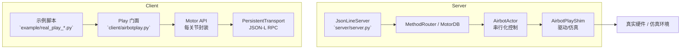

# Hardware-Sim示例 README

本项目提供一个基于 `Play` 门面封装的运动控制 RPC 服务 (`server/server.py`) 以及多份真实设备示例脚本（位于 `example/`）。

可以把 `server/server.py` 理解成“为仿真器创建一个 Airbot 实例”的入口：
- 真机本身就是一台已经存在的机器人，只需要通过总线直接下发指令；
- 而仿真器没有“现成的机器人”，需要先基于 MuJoCo 场景创建一个机械臂实例（`AirbotPlayShim`），再通过这个实例收发指令。

因此，启动 `server/server.py` 的目的，就是先在本地创建并维护这台“虚拟 Airbot 机器人”，然后各个 `example/real_play_*.py` 脚本再通过 TCP/JSON-Lines 接口像操作真机一样去控制它。

下文介绍如何启动服务、如何运行关键脚本，并整理 `Play` 提供的主要接口。

## 架构概览



- **客户端**：示例脚本通过 `Play` 门面拉起一组 `Motor` 对象，复用 `PersistentTransport` 建立 JSON-Lines RPC 链路，并按关节批量下发命令。
- **服务器**：`JsonLineServer` 解析每行请求，交由 `MethodRouter/MotorDB` 转成 Actor 指令；`AirbotActor` 在独立线程节拍内顺序执行动作，并借助 `AirbotPlayShim` 驱动真实硬件或仿真。
- **反馈**：所有关节状态由 `AirbotActor` 采集，沿同一链路回传给客户端调用者。

## 快速开始

1. **启动 RPC 服务**
   ```bash
   cd examples/motor/server
   python server.py --host 0.0.0.0 --port 8890 --ctrl-hz 200
   ```
   这会拉起 `AirbotActor` 后台线程，并在指定 host/port 上开启 JSON-Lines RPC，示例脚本默认连接 `127.0.0.1:8890`。

2. **运行零位示例**
   ```bash
   cd examples/motor/example
   python example/real_play_return_zero.py
   ```
   该脚本会初始化所有关节（含夹爪）、发零位 PVT 指令并等待电机收敛。

> **提示**：任意示例都依赖已经运行的 `server.py`。若控制端与示例在不同机器，请把示例脚本中的 `HOST` / `PORT` 改成服务器地址。

## Play 接口一览

| 接口 | 作用 | 输出格式 | 示例脚本片段 |
| --- | --- | --- | --- |
| `create()` | 根据 6 个关节规格与夹爪，复用 `PersistentTransport` 构造 `Play` 对象。 | `Play` 实例（同步返回） | 所有 `example/real_play_*.py` 的 `_create_play()` |
| `init(interface, spin_freq)` | 迭代所有电机调用 `Motor.init()`，配置 CAN 接口与循环频率。 | `await` 后得 `bool`，全部成功才为 `True` | `real_play_return_zero.py` 第一步；`real_play_pos_ctrl.py` |
| `uninit()` | 逐个释放通信周期，回到空闲状态。 | `await` 后得 `bool` | `real_play_test_init.py` 的步骤 6；`real_play_test_interfaces.py` |
| `ping()` | 给所有电机发送心跳确认链路健康。 | `await` 后得 `bool` | `real_play_test_interfaces.py` |
| `enable()` / `disable()` | 批量切换电机使能状态。 | `await` 后得 `bool` | `real_play_pos_ctrl.py` 主流程；`real_play_test_interfaces.py` 展示重复调用行为 |
| `set_zero()` | 将当前位置标记为零点。 | `await` 后得 `bool` | `real_play_test_interfaces.py` 在 enable 后调用 |
| `pvt(pos, max_vel)` | 下发位置-速度轨迹，数组长度需匹配关节数(含夹爪)。 | `await` 后得 `bool` | `real_play_return_zero.py` 的 `send_zero_command()`；`real_play_pos_ctrl.py` |
| `csv(velocities)` | 下发 CSV（Cyclic Synchronous Velocity）速度控制指令，数组长度需匹配关节数(含夹爪)。速度单位为 rad/s。在仿真器中，CSV 模式通过速度积分维护内部位置参考，当速度为 0 时自动保持当前位置，防止机械臂因重力回落。 | `await` 后得 `bool` | `real_play_kbd_ctrl.py` 持续发送速度命令 |
| `state()` | 汇总每个电机的 `is_valid/pos/vel` 等字段，供轮询或断言使用。 | `await` 后得 `List[Dict[str, Any]]`，每个元素含 `is_valid/pos/vel/eff/motor_temp/motor` | `_wait_until_reached()`、`real_play_test_interfaces.py` 中的多处打印 |

**预留接口（尚未在示例中实现具体业务，但 API 已暴露）**

- `reset_error()`：清除电机自检错误。
- `mit()`：面向 MIT 模式的高频控制（需要每个关节的 `q_ref/dq_ref/kp/kd/tau_ff`）。
- `get_param()` / `set_param()` / `persist_param()` / `params()`：查询与更新底层驱动参数。

## `example/` 脚本说明

| 脚本 | 功能概述 | 运行方式 | 关键参数 |
| --- | --- | --- | --- |
| `real_play_return_zero.py` | 初始化所有关节（含夹爪），执行 `init → enable → PVT 零位 → disable → uninit`，用于验证整链路归零能力。 | `python example/real_play_return_zero.py` | 无参数 |
| `real_play_pos_ctrl.py` | 单次位置下发并轮询到位，支持夹爪。 | `python example/real_play_pos_ctrl.py -j q1 q2 q3 q4 q5 q6 -g 0.01` | `-j/--joints` 六个弧度值（必填）；`-g/--gripper` 夹爪行程；范围在脚本顶部给定。 |
| `real_play_pvt_swing.py` | 关节 1 按指定周期做简易 PVT 摆动，演示持续 PVT/参数限制。 | `python example/real_play_pvt_swing.py -T 8` | `-T` 摆动周期(2–20s) |
| `real_play_test_init.py` | 流程化测试 `init → pvt → uninit → pvt`，第二次下发应失败，用于验证守护逻辑。 | `python example/real_play_test_init.py` | 无参数 |
| `real_play_kbd_ctrl.py` | 使用键盘在 CSV 速度模式下控制机械臂各关节（1/2 控制关节 1，3/4 控制关节 2，…），适合在仿真环境中交互式体验速度控制与姿态保持效果。 | `python example/real_play_kbd_ctrl.py --speed 0.5` | `--host`、`--port` 指定服务地址；`--speed` 控制关节速度幅值(rad/s) |
| `real_play_test_interfaces.py` | 依次调用 `create/init/ping/enable/set_zero/pvt/state/disable/uninit` 并打印返回类型，方便调试接口表现。 | `python example/real_play_test_interfaces.py --host 127.0.0.1 --port 8890 --interface can0 --spin-freq 200` | `--host`、`--port`、`--interface`、`--spin-freq` 为可选参数 |

> 若需要拓展新的示例，可将以上脚本作为模板，沿用 `_create_play()` 与资源释放模式，保证 `enable()`、`disable()`、`init()`、`uninit()`、`connect()`、`close()` 成对出现。

## 测试注意事项

在使用 `Play` API 进行测试时，需要注意接口调用的状态依赖关系，错误的调用顺序会导致操作失败：

### 正确的调用顺序

标准流程应遵循以下顺序：
```
create() → connect() → init() → enable()  → pvt()/csv()/其他控制命令 → disable() → uninit() → close()
```

### 状态限制

1. **`init()` 之前**：
   - ❌ **不能**调用 `enable()`：电机未初始化，使能操作会失败或返回 `False`
   - ❌ **不能**获取完整状态：`state()` 可能返回无效数据或部分字段缺失
   - ❌ **不能**执行控制命令：`pvt()`、`csv()`、`mit()` 等控制接口会失败
   - ⚠️ `ping()` 可能返回 `False` 或无法正常工作

2. **`uninit()` 之后**：
   - ❌ **不能**执行控制命令：`pvt()`、`csv()`、`mit()` 等控制接口会失败（通信周期已释放）
   - ❌ **不能**调用 `enable()`：电机已卸载，使能操作无效
   - ⚠️ `ping()` 可能失败或返回 `False`

3. **`enable()` 之前**：
   - ❌ **不能**执行控制命令：`pvt()` 等命令需要电机处于使能状态

### 验证示例

- `real_play_test_interfaces.py` 演示了在 `init()` 前调用 `enable()`、`ping()`、`state()` 的行为
- `real_play_test_init.py` 验证了 `uninit()` 后再次调用 `pvt()` 会失败的保护逻辑

> **提示**：编写测试脚本时，请严格按照上述顺序调用接口，避免因状态不匹配导致的测试失败。

## 运行建议

- 每次运行前确认 `server.py` 终端无错误输出，并确保示例脚本中的 `HOST/PORT` 与服务器一致。
- 控制真实硬件时，请先调小速度/幅值，再逐步提高，避免误操作。
- CSV 模式已在仿真器中实现，支持速度控制和位置保持。使用 `csv()` 时，建议持续发送速度命令（例如在循环中每 20ms 发送一次），以获得流畅的控制效果。
- 如果部分接口（例如 `mit()`）尚未在服务器 Shim 中实现，可在 `server/airbot_play_shim.py` 中扩展对应 handler，再在示例脚本中调用。

